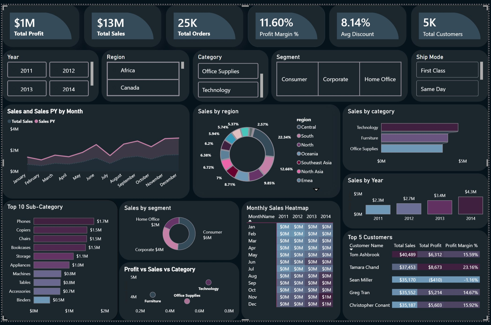

# 📊 SalesPulse — Executive Sales Analytics Dashboard


> A single-page executive dashboard built in Power BI Desktop using the Global Superstore dataset. Covers sales performance, profitability, customer analysis, regional breakdown, and time intelligence — all in one interactive view.

---

## 🖼️ Dashboard Preview



---

## 📌 Key Metrics

| Metric | Value |
|--------|-------|
| 💰 Total Sales | $12.63M |
| 📈 Total Profit | $1.46M |
| 🎯 Profit Margin | 11.60% |
| 🛒 Total Orders | 25,035 |
| 👥 Total Customers | 4,873 |
| 🏷️ Avg Discount | 8.14% |

---

## 📊 Visuals Included

| # | Visual | Type | Insight |
|---|--------|------|---------|
| 1 | KPI Cards | Card | 6 headline metrics |
| 2 | Sales Trend Over Time | Line Chart | Monthly Sales vs Sales PY |
| 3 | Sales by Region | Donut Chart | 13 global regions |
| 4 | Sales by Category | Bar Chart | Technology leads at $4.74M |
| 5 | Sales by Segment | Donut Chart | Consumer = 51.4% of sales |
| 6 | Top 10 Sub-Category | Bar Chart | Phones #1 · Tables = -$64K profit ⚠️ |
| 7 | Monthly Sales Heatmap | Matrix | Seasonality patterns 2011–2014 |
| 8 | Sales vs Profit Scatter | Scatter | Category profitability analysis |
| 9 | Top 5 Customers | Table | Sales · Profit · Margin per customer |
| 10 | Sales by Year | Bar Chart | 90% growth 2011→2014 |
| 11 | Interactive Slicers | Button Slicer | Year · Region · Category · Segment · Ship Mode |

---

## 🧠 DAX Measures (44 Total)

### Core KPIs
```dax
Total Sales = SUM(fact_sales[sales])
Total Profit = SUM(fact_sales[profit])
Profit Margin % = DIVIDE([Total Profit], [Total Sales], 0)
Total Orders = DISTINCTCOUNT(fact_sales[order_id])
Total Customers = DISTINCTCOUNT(fact_sales[customer_id])
Avg Discount = AVERAGE(fact_sales[discount])
```

### Time Intelligence
```dax
Sales PY = CALCULATE([Total Sales], DATEADD(dim_date[Date], -1, YEAR))

Sales YoY % =
VAR CurrentSales = [Total Sales]
VAR PrevSales = [Sales PY]
RETURN
    IF(
        ISBLANK(CurrentSales) || ISBLANK(PrevSales),
        BLANK(),
        DIVIDE(CurrentSales - PrevSales, PrevSales, BLANK())
    )

Sales YTD = CALCULATE([Total Sales], DATESYTD(dim_date[Date]))
```

### Regional & Category Breakdowns
```dax
Sales - Technology = CALCULATE([Total Sales], fact_sales[category] = "Technology")
Sales - West = CALCULATE([Total Sales], fact_sales[region] = "West")
Profit - Central = CALCULATE([Total Profit], fact_sales[region] = "Central")
-- ... and 35 more measures
```

---

## 🗄️ Data Model — Star Schema

```
                    ┌─────────────┐
                    │  dim_date   │
                    │  Date (PK)  │
                    └──────┬──────┘
                           │ 1:M
        ┌──────────────────▼──────────────────┐
        │              fact_sales              │
        │  order_id · sales · profit · discount│
        │  order_date · ship_date · quantity   │
        └──────┬───────────┬──────────┬────────┘
               │           │          │
            1:M│        1:M│       1:M│
        ┌──────▼───┐  ┌────▼────┐  ┌──▼────────┐
        │dim_region│  │dim_cate │  │ kpi_yoy   │
        │region(PK)│  │gory(PK) │  │order_year │
        └──────────┘  └─────────┘  └───────────┘
```

**Relationships:**
- `fact_sales[order_date]` → `dim_date[Date]` *(Active · Many-to-One)*
- `fact_sales[region]` → `dim_region[region]` *(Active · Many-to-One)*
- `fact_sales[category]` → `dim_category[category]` *(Active · Many-to-One)*
- `fact_sales[order_year]` → `kpi_yoy[order_year]` *(Active · Many-to-One)*

---

## 🔑 Key Business Insights

> 1. 📈 **Sales grew 90.6%** from $2.26M (2011) to $4.30M (2014)
> 2. 🏆 **Technology** is the highest revenue category — $4.74M total
> 3. ⚠️ **Tables sub-category loses money** — $757K in sales but **-$64K profit**
> 4. 🌍 **Central region** leads in profit — $311K (21.3% of total)
> 5. 👤 **Consumer segment** = 51.4% of all sales ($6.50M)
> 6. 📅 **November & December** are always peak months (seasonality)
> 7. 💸 **Southeast Asia** has the lowest profit margin — just 2% despite $883K in sales

---

## 🛠️ Tools & Technologies

| Tool | Purpose |
|------|---------|
| Power BI Desktop | Dashboard development |
| DAX | 44 custom measures |
| Power Query (M) | Data transformation |
| Global Superstore | Dataset (9,994 rows · 21 columns) |
| Star Schema | Data model architecture |

---

## 📁 Project Structure

```
salespulse-powerbi/
│
├── 📊 superstore_analytics_2026.pbix   ← Main Power BI file
├── 📄 README.md                         ← This file
└── 📁 assets/
    └── 🖼️ dashboard_preview.png         ← Dashboard screenshot
```

---

## 🚀 How to Open

1. Download `superstore_analytics_2026.pbix`
2. Open with **Power BI Desktop** (free — [download here](https://powerbi.microsoft.com/desktop))
3. The data is embedded — no external connections needed
4. All 44 measures and relationships are pre-built

---

## 👨‍💻 About

**Venkatraman R** — Data Science & AI Engineer  
📍 Chennai, India

[](https://venkatraman0400-blip.github.io/venkatraman-portfolio)
[](https://linkedin.com/in/venkatraman0400)
[](https://github.com/venkatraman0400-blip)

---

*Built as part of Data Science & AI portfolio — Boston Institute of Analytics, 2026*
